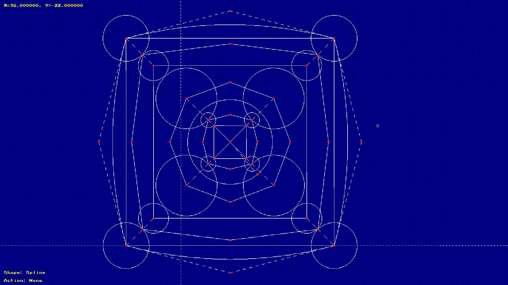

# CAD
A simple CAD program made in C++ using the [PixelGameEngine by One Lone Coder (javidx9)](https://github.com/OneLoneCoder/olcPixelGameEngine)

This is a simple CAD program that can make:
- Lines
- Boxes
- Circles
- Splines (Bezier Curve)

So far you can't save things, but I might add that at a later point.

---

Note:  
this uses Version 2.20 of olcPGE
[link to release](https://github.com/OneLoneCoder/olcPixelGameEngine/releases/tag/v2.20)

---

## Screenshot



---

## How to use

How you use this program is that you first swlect what shape you want to use.
The default one is Line, but you can change it using the number keys:
- 1  Line
- 2  Box
- 3  Circle
- 4  Spline

To draw a shape,
press the W button on your keyboard to place the first node,
then press the left mouse button to place the next node.
If the shape has more than 2 nodes (Curve), 
you will have to press the left mouse button
untill the shape is done.

You can tell that is is done by it saying "Action: None" in the bottom left.

You can see what Shape you have selection 
by looking in the bottom left 
where it says "Shape: " then the selected shape

You can move a node by hovering over the node you want to move
then pressing the E button on your keyboard.
Then press and release the left mouse button to stop moving the node

You can pan around by holding down the right mouse button, and moving the mouse.

You can zoom in and out by scrolling the mouse wheel, or pressing the Q or A on your keyboard

You can also toggle the HUD/UI by pressing the S key on your keyboard.

---

## Quickstart

### Compile/Build
compiles/builds the C++ code in `src/impl/`   
and headers in `src/incl/`   
to `build/debug/`  
```sh
make build_debug
```
or
```sh
make
```

compiles/builds the C++ code in `src/impl/`   
and headers in `src/incl/`   
to `build/release/`  
```sh
make build_release
```

### Run
runs the compiled binary in `build/debug/`
```sh
make run
```

runs the compiled binary in `build/release/`
```sh
make run_release
```

### Clean
removes the `build/` folder
```sh
make clean
```

### Multiple at once
You can run multiple ones at once, for example:
```sh
make build run
```
or:
```sh
make clean build
```
etc...
